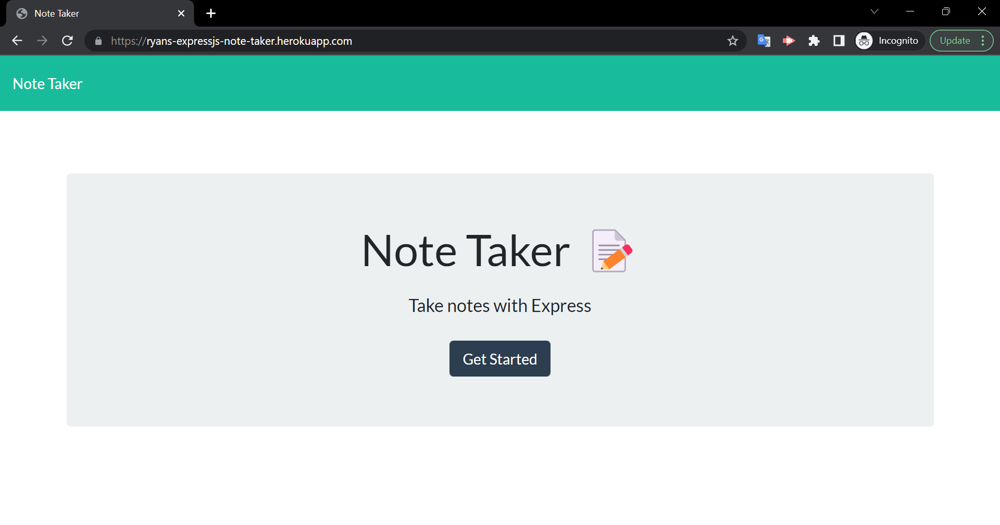
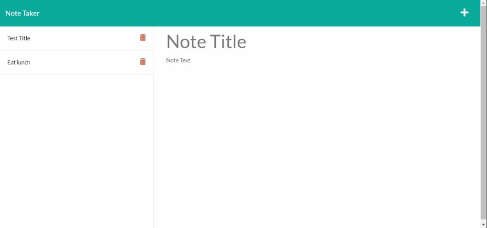

  # Note Taker

  ## Table of Contents

  - [Description](#description)
  - [Installation](#installation)
  - [Usage](#usage)
  - [Preview](#preview)
  - [Contact](#contact)
  - [License](#license)

  ## Description

  A simple website, designed for those with busy schedules, that allows a user to quickly write, save, and delete notes.  
  
  ## Installation

  [Check out the deployed site here!](https://ryans-expressjs-note-taker.herokuapp.com/)

  To run the files locally:
  - Ensure that Node.js is installed on your local machine
  - Clone the GitHub repo to your local machine
  - Use your local machine's command-line to navigate to the cloned repo's directory
  - Run "npm install"
  - Run "npm start"
  - Using your browser of choice, load in the following url:  http://localhost:3001/

  ## Usage

  With this simple browser application, a user may take notes for whatever topics they desire. After being presented with the landing page and clicking on the link to the notes page, the user is presented with an organized page where notes are displayed.  When the user enters any input for a note's title and note's text, they may then save the note, which appears on the left-hand column on the page, added to the list other existing notes. Upon clicking note title text on the left-hand column, the details of the note are presented on the right side of the page. Whenever the user clicks the write icon at the top right of the page, the user is prompted for a new note title and note text, which may then be saved. Additionally, the user may click the trash can icon on any of the existing notes along the left-hand column to delete notes that were previously written.

  ## Preview

  
  
  
  ## Contact

  - Github: [Darxmarx](https://github.com/Darxmarx)

  ## License

  